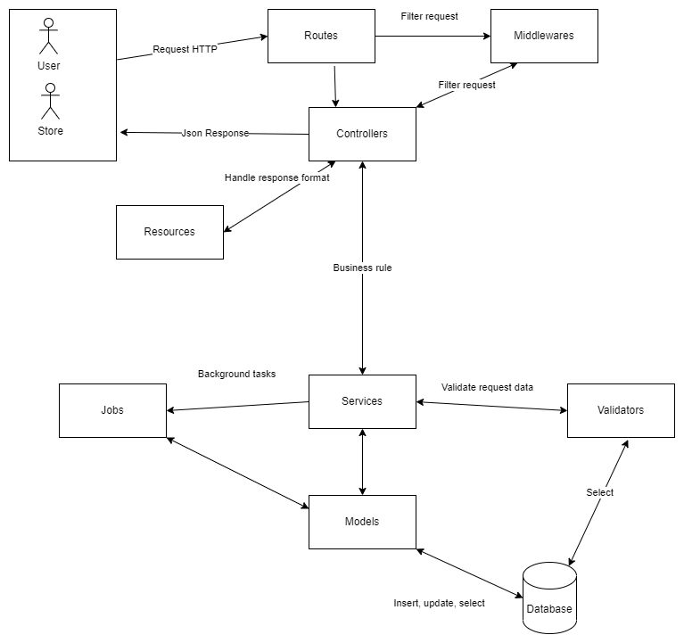
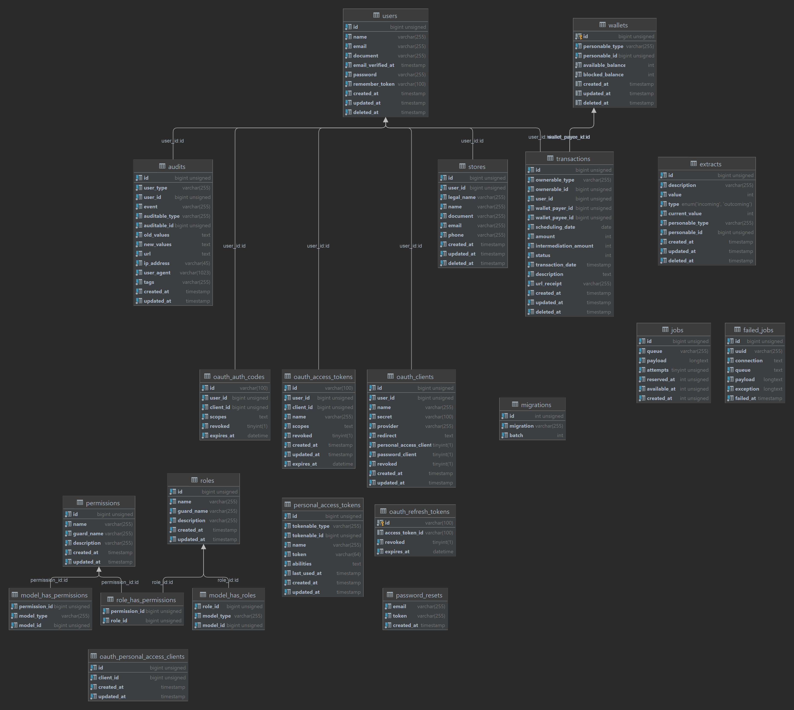
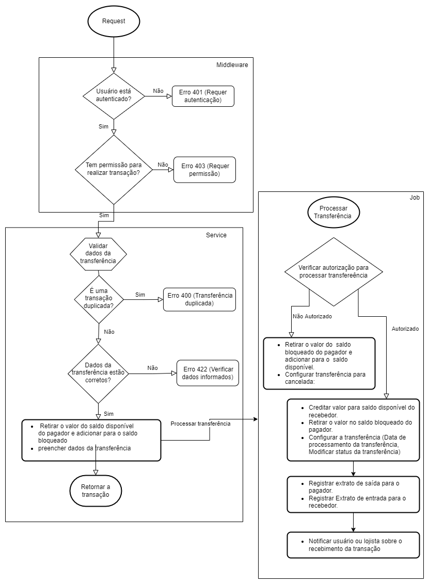
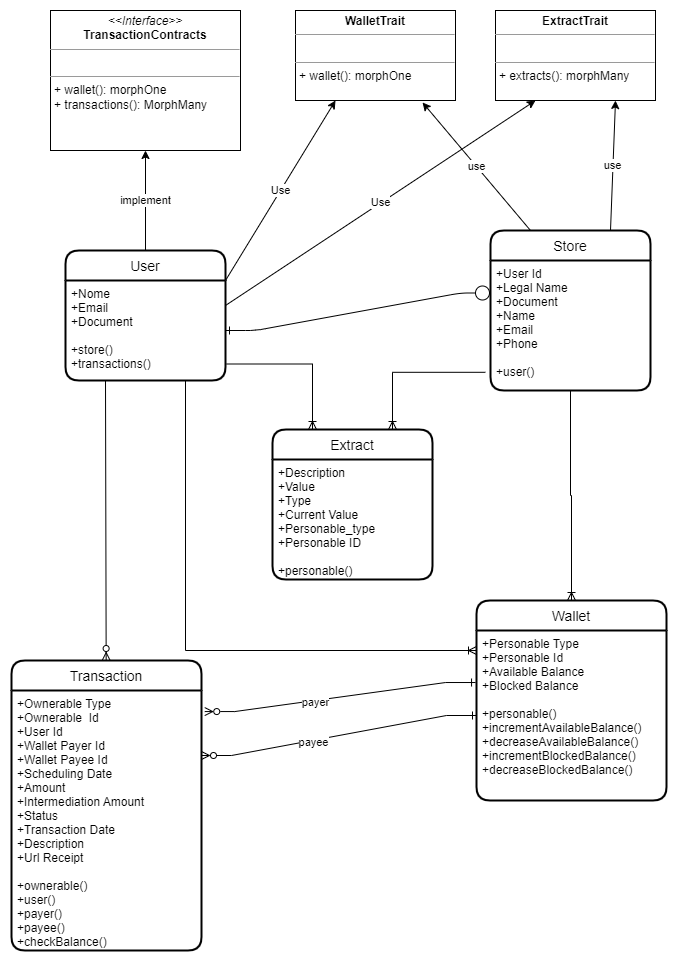

## installation :

after install the source code open Terminal to use these command line:

- Run `composer install` ( may need to use "composer update").
- Rename or copy `.env.example` file to `.env` and write required database information.
- create new `database`.
- Use your configuration in `.env`
- Run `php artisan key:generate` command.
- Run `php artisan migrate --seed` command.
- Run `php artisan passport:install` command.
- Run `php artisan serve` command.
- Run `php artisan queue:listen` command.

### Run test
- Rename or copy `.env.testing.example` file to `.env.testing` and write required database information.
- Run `php artisan test` command.

### Features
- Transfer flow between two or more users.
- Schedule transfers.
- Users can cancel a scheduled transaction.
- Charge an intermediation fee for transactions.
- Notify the payer that the transfer cannot take place.

## Packages Used
### [Laravel Passport](https://laravel.com/docs/8.x/passport).

### [Laravel Permission](https://spatie.be/docs/laravel-permission/v4/prerequisites)

### [Laravel Auditing](http://www.laravel-auditing.com/)

## Documents
### Architecture

### Database UML

### Transaction Flow

### Diagram

- [API Document](https://documenter.getpostman.com/view/328294/UVkjwyDr)
- [Postman collection](https://github.com/RodrigoFraga/amount-transfers-api/blob/main/documents/AmountTransfers.postman_collection.json)
- [Postman environment](https://github.com/RodrigoFraga/amount-transfers-api/blob/main/documents/AmountTransfers.postman_environment.json)
- [Test planning](https://github.com/RodrigoFraga/amount-transfers-api/blob/main/documents/test_planning.pdf)
- [Architecture](https://github.com/RodrigoFraga/amount-transfers-api/blob/main/documents/architecture.drawio.xml)
- [Database UML](https://github.com/RodrigoFraga/amount-transfers-api/blob/main/documents/database.uml)
- [Transaction Flow](https://github.com/RodrigoFraga/amount-transfers-api/blob/main/documents/transaction_flow.drawio.xml)
- [Diagram](https://github.com/RodrigoFraga/amount-transfers-api/blob/main/documents/diagram.drawio.xml)

## License

The [Laravel framework](https://laravel.com) is open-sourced software licensed under the [MIT license](https://opensource.org/licenses/MIT).
